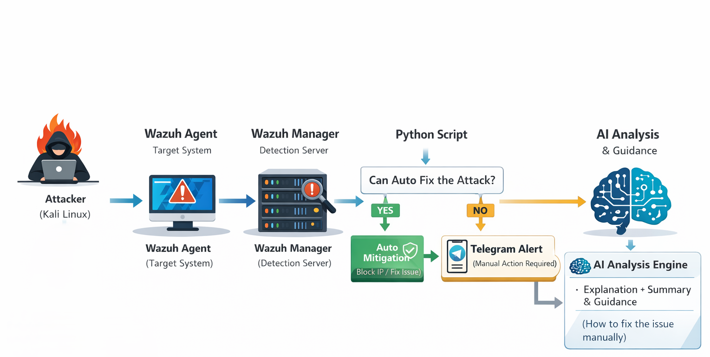
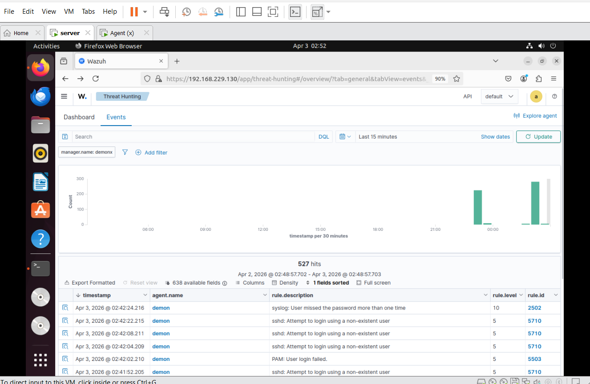
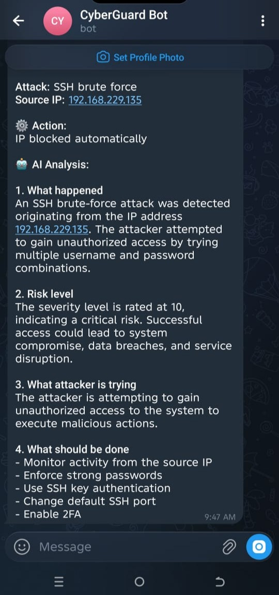
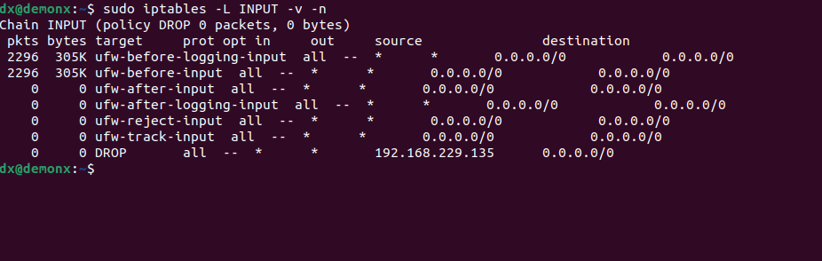

# 🛡️ WazuhGuard AI

### 🚀 AI-Powered SOC Automation | Detection • Response • Intelligence


---

## 🚨 Problem

Security Operations Centers (SOCs) face:

* Alert fatigue from thousands of logs
* Slow manual incident response
* Lack of intelligent attack understanding

---

## 💡 Solution

**WazuhGuard AI** is an automated SOC system that:

* Detects attacks using Wazuh SIEM
* Sends real-time alerts via Telegram
* Automatically mitigates threats (IP blocking)
* Uses AI to explain attacks and suggest fixes

---

## 🎯 Key Outcomes

* ⚡ Reduced response time from minutes → seconds
* 🚫 Automatic threat mitigation
* 🧠 Intelligent attack explanation
* 📩 Instant alerting system

---

## 🧪 Lab Environment

| Component     | Technology Used             |
| ------------- | --------------------------- |
| Attacker      | Kali Linux                  |
| Target System | Ubuntu Server (Wazuh Agent) |
| SIEM          | Wazuh Manager               |
| Automation    | Python                      |
| Alerting      | Telegram Bot API            |
| AI Engine     | OpenAI API                  |

---

## 🧠 Architecture




🔍 Flow Diagram
```text
Attacker (Kali Linux)
        ↓
Wazuh Agent (Target System)
        ↓
Wazuh Manager (Detection Server)
        ↓
Python Alert Handler
        ↓
        ┌───────────────────────────────┐
        │ Can Auto Fix the Attack?      │
        └───────────────────────────────┘
             ↓ YES                         ↓ NO
 ┌────────────────────────┐      ┌────────────────────────────┐
 │ Auto Mitigation        │      │ Telegram Alert              │
 │ (Block IP / Fix Issue) │      │ (Manual Action Required)    │
 └────────────────────────┘      └────────────────────────────┘
             ↓                              ↓
             └──────────────┬───────────────┘
                            ↓
                  AI Analysis Engine
                            ↓
        ┌──────────────────────────────────────┐
        │ Explanation + Summary + Guidance     │
        │ (How to fix the issue manually)      │
        └──────────────────────────────────────┘
```

1. Attacker initiates an attack (e.g., brute force or network scan)  
2. Wazuh detects suspicious activity  
3. Python alert handler processes the event  
4. The system evaluates whether automatic mitigation is possible  

- If YES → the attack is blocked automatically  
- If NO → a Telegram alert is sent for manual intervention  

5. AI analyzes the attack and provides:
   - Explanation  
   - Summary  
   - Step-by-step remediation guidance 

---

## 🔁 Workflow

1. Attacker launches attack (SSH brute force / scan)
2. Wazuh detects malicious activity
3. Alert forwarded to Python handler
4. Telegram bot sends instant alert
5. System auto-blocks attacker IP
6. AI analyzes attack and generates explanation
7. If auto-fix fails → AI provides manual guidance

---

## 💣 Attack Simulation

* 🔐 SSH Brute Force Attack
* 🌐 Network Scanning (Nmap)
* 🚫 Multiple Failed Login Attempts

✔️ Detected by Wazuh
✔️ Blocked via firewall
✔️ Alert sent via Telegram
✔️ AI explanation generated

---

## 📸 Demo

### 🔍 Detection (Wazuh)



### 📩 Telegram Alert



### 🚫 Auto Mitigation



### 🧠 AI Analysis


---

## 📊 Results

| Feature             | Status |
| ------------------- | ------ |
| Real-time Detection | ✅      |
| Auto Response       | ✅      |
| Telegram Alerts     | ✅      |
| AI Explanation      | ✅      |

---

## 🛠️ Tech Stack

* Wazuh SIEM
* Python
* Linux (iptables)
* Telegram Bot API
* OpenAI API

---

## ⚙️ Installation

```bash
git clone https://github.com/Demonx911/AI-SOC-Automation.git
cd AI-SOC-Automation
pip install -r requirements.txt
```

---

## 🚨 Example Alert

```
🚨 ALERT: SSH Brute Force Detected  
IP: 192.168.1.10  
Action: Blocked  
Status: Mitigated  
```

---

## 🧠 AI Analysis Output

```
Attack Type: SSH Brute Force  
Risk Level: High  
Explanation: Multiple login attempts detected  
Recommendation: Use SSH keys, disable root login  
```

---

## 🧠 Skills Demonstrated

* SIEM (Wazuh)
* Incident Response Automation
* Threat Detection & Analysis
* Python Scripting
* API Integration
* AI in Cybersecurity

---

## ⚠️ Disclaimer

This project is for **educational and ethical cybersecurity research purposes only**.

---

## 👨‍💻 Author

**Asker (Demonx911)**
Cybersecurity Researcher | SOC Analyst | AI Security Enthusiast

---
